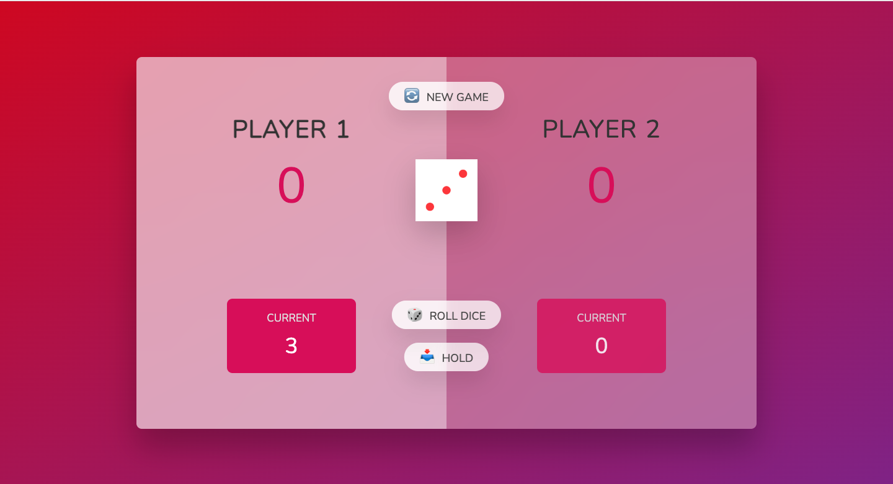

# Pig-Game-demo-App

Welcome to the Pig Game! This project is a simple dice game implemented using HTML, CSS, and JavaScript. The game can be played by two players. The objective is to be the first player to reach 100 points. Players take turns to roll a dice and accumulate points, but rolling a 1 will reset the current score for that turn.

### Game flow chart

## Table of Contents

* Game Rules
* Technologies Used
* How to Play
* JavaScript Documentation

#### Game Rules

The game is played with two players on a single screen.
Players take turns rolling a dice. The value of the dice is added to their current score.
If a player rolls a 1, their current score is reset to 0, and it becomes the next player's turn.
A player can choose to "Hold," which adds their current score to their total score, and it becomes the next player's turn.
The first player to reach 100 points on their total score wins the game.

### Game Screenshot

#### Technologies Used

* HTML
* CSS
* JavaScript

#### How to play 

* Open the game in your web browser.
* Player 1 starts the game by clicking the "Roll Dice" button.
* The player accumulates points until they decide to "Hold" or roll a 1.
* If a player rolls a 1, their current score is reset to 0, and it becomes the next player's turn.
* The first player to reach 100 points wins the game.

